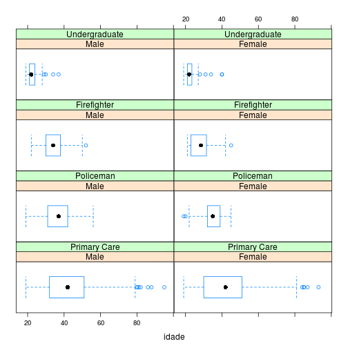
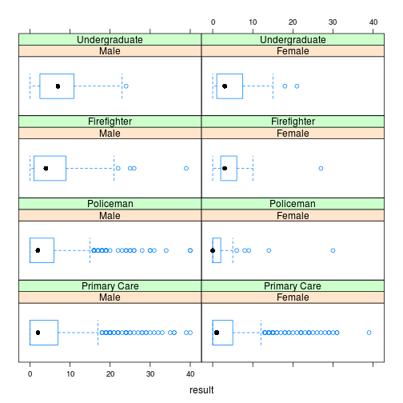

AUDIT - TRI
========================================================

Este é o relatório das análises contidas no script audit.R. O objetivo é apresentar de forma mais humana as análises conduzidas no R.

## Bibliotecas do R


```r
## libraries ----
library(psych)
library(ltm)
library(RColorBrewer)
library(car)
library(lattice)
library(mirt)

# Import data ----
auditdf <- read.csv("audit.csv", header = TRUE, na.strings = c("NA", ""), strip.white = TRUE)
auditdf <- auditdf[, 1:15]
```


## Exclusão de casos

```r
## Correct errors
auditdf <- subset(auditdf, auditdf$idade > 18)  # Exclude less than 18 years
auditdf$fr5doses[auditdf$fr5doses > 4] <- NA  # fixing errors
auditdf$feriment[auditdf$feriment == 1] <- NA  # fixing errors
auditdf$parbeber[auditdf$parbeber > 4 | auditdf$parbeber == 1 | auditdf$parbeber == 
    3] <- NA  # fixing errors
auditdf$sexo[auditdf$sexo == 0] <- NA  # Inserting NA
auditdf$sexo <- factor(auditdf$sexo, labels = c("Male", "Female"))
auditdf$servico <- factor(auditdf$servico, labels = c("Primary Care", "Policeman", 
    "Firefighter", "Undergraduate"))
```


## Computando valores do AUDIT e zonas de classificação

```r

## Compute audit score
auditdf$result <- auditdf$freq + auditdf$doses + auditdf$fr5doses + auditdf$nconspar + 
    auditdf$nconsfaz + auditdf$bebmanha + auditdf$culpado + auditdf$nlembrou + 
    auditdf$feriment + auditdf$parbeber  # computing audit values

# classifying participants using as reference cutoff points from AUDIT-babor
auditdf$clas[auditdf$result <= 7] <- "Education"
auditdf$clas[auditdf$result > 7 & auditdf$result <= 15] <- "Brief Advice"
auditdf$clas[auditdf$result > 15 & auditdf$result <= 19] <- "Brief Advice and brief counseling"
auditdf$clas[auditdf$result > 20] <- "Referral for Clinical"
```


# Estatísticas Descritivas

## Sexo
Por serviço:

```r
by(auditdf$sexo, auditdf$servico, summary)  # by sex
```

```
## auditdf$servico: Primary Care
##   Male Female 
##    631    529 
## -------------------------------------------------------- 
## auditdf$servico: Policeman
##   Male Female   NA's 
##   1081     63    141 
## -------------------------------------------------------- 
## auditdf$servico: Firefighter
##   Male Female 
##    227     24 
## -------------------------------------------------------- 
## auditdf$servico: Undergraduate
##   Male Female   NA's 
##     88    111      2
```


## Idade
### Geral

```r
by(auditdf$sexo, auditdf$servico, summary)  # by sex
```

```
## auditdf$servico: Primary Care
##   Male Female 
##    631    529 
## -------------------------------------------------------- 
## auditdf$servico: Policeman
##   Male Female   NA's 
##   1081     63    141 
## -------------------------------------------------------- 
## auditdf$servico: Firefighter
##   Male Female 
##    227     24 
## -------------------------------------------------------- 
## auditdf$servico: Undergraduate
##   Male Female   NA's 
##     88    111      2
```


### Por sexo

```r
boxplot(idade ~ sexo, data = auditdf)  # by sexo
```

 


### Por serviço

```r
boxplot(idade ~ servico, data = auditdf)  # by servico
```

 


### Por classificação no audit

```r
boxplot(idade ~ clas, data = auditdf)  # by clas
```

 


### Por sexo e serviço

```r
bwplot(~idade | sexo * servico, data = auditdf)
```

 


## Serviço

```r
table(auditdf$servico)
```

```
## 
##  Primary Care     Policeman   Firefighter Undergraduate 
##          1160          1285           251           201
```


## Classificação do AUDIT

### Geral

```r
cbind(table(auditdf$clas))
```

```
##                                   [,1]
## Brief Advice                       450
## Brief Advice and brief counseling   77
## Education                         2260
## Referral for Clinical               74
```


### Por Serviço e sexo

```r
bwplot(~result | sexo * servico, data = auditdf)
```

 


# Teoria de Resposta ao Item

## Estatísticas descritivas

### Geral dos itens

```r
describe(auditdf[6:15])
```

```
##          vars    n mean   sd median trimmed  mad min max range skew
## freq        1 2897 1.18 1.15      1    1.06 1.48   0   4     4 0.62
## doses       2 2897 0.76 1.12      0    0.52 0.00   0   4     4 1.51
## fr5doses    3 2896 0.71 1.07      0    0.49 0.00   0   4     4 1.35
## nconspar    4 2897 0.16 0.59      0    0.00 0.00   0   4     4 4.45
## nconsfaz    5 2897 0.15 0.52      0    0.00 0.00   0   4     4 4.65
## bebmanha    6 2897 0.10 0.50      0    0.00 0.00   0   4     4 6.17
## culpado     7 2897 0.28 0.76      0    0.09 0.00   0   4     4 3.37
## nlembrou    8 2897 0.22 0.67      0    0.04 0.00   0   4     4 3.88
## feriment    9 2887 0.37 0.94      0    0.13 0.00   0   4     4 2.56
## parbeber   10 2883 0.56 1.22      0    0.24 0.00   0   4     4 2.01
##          kurtosis   se
## freq        -0.57 0.02
## doses        1.45 0.02
## fr5doses     0.65 0.02
## nconspar    21.32 0.01
## nconsfaz    25.12 0.01
## bebmanha    40.67 0.01
## culpado     11.93 0.01
## nlembrou    16.42 0.01
## feriment     5.81 0.02
## parbeber     2.61 0.02
```


### Matrix de correlação entre os itens

```r
round(cor(auditdf[6:15], method = "kendal", use = "complete.obs"), 2)  # kendall correlation coef among audit items
```

```
##          freq doses fr5doses nconspar nconsfaz bebmanha culpado nlembrou
## freq     1.00  0.62     0.65     0.30     0.30     0.23    0.37     0.34
## doses    0.62  1.00     0.72     0.34     0.30     0.22    0.37     0.38
## fr5doses 0.65  0.72     1.00     0.37     0.32     0.26    0.40     0.40
## nconspar 0.30  0.34     0.37     1.00     0.38     0.33    0.38     0.40
## nconsfaz 0.30  0.30     0.32     0.38     1.00     0.42    0.47     0.45
## bebmanha 0.23  0.22     0.26     0.33     0.42     1.00    0.29     0.32
## culpado  0.37  0.37     0.40     0.38     0.47     0.29    1.00     0.51
## nlembrou 0.34  0.38     0.40     0.40     0.45     0.32    0.51     1.00
## feriment 0.22  0.25     0.26     0.25     0.35     0.23    0.38     0.36
## parbeber 0.30  0.29     0.33     0.33     0.35     0.29    0.37     0.40
##          feriment parbeber
## freq         0.22     0.30
## doses        0.25     0.29
## fr5doses     0.26     0.33
## nconspar     0.25     0.33
## nconsfaz     0.35     0.35
## bebmanha     0.23     0.29
## culpado      0.38     0.37
## nlembrou     0.36     0.40
## feriment     1.00     0.37
## parbeber     0.37     1.00
```


### Alfa de Cronbach

#### Geral: 

```r
alpha(auditdf[6:15])  # Cronbach's alpha
```

```
## 
## Reliability analysis   
## Call: alpha(x = auditdf[6:15])
## 
##   raw_alpha std.alpha G6(smc) average_r S/N    ase mean   sd
##       0.86      0.88    0.89      0.41   7 0.0066 0.45 0.59
## 
##  lower alpha upper     95% confidence boundaries
## 0.85 0.86 0.87 
## 
##  Reliability if an item is dropped:
##          raw_alpha std.alpha G6(smc) average_r S/N alpha se
## freq          0.84      0.86    0.87      0.41 6.3   0.0075
## doses         0.84      0.86    0.87      0.41 6.3   0.0075
## fr5doses      0.83      0.86    0.86      0.40 6.0   0.0077
## nconspar      0.85      0.86    0.87      0.41 6.4   0.0072
## nconsfaz      0.85      0.86    0.87      0.41 6.2   0.0072
## bebmanha      0.85      0.87    0.87      0.42 6.5   0.0071
## culpado       0.84      0.86    0.87      0.41 6.2   0.0074
## nlembrou      0.84      0.86    0.87      0.41 6.2   0.0073
## feriment      0.85      0.87    0.88      0.43 6.8   0.0071
## parbeber      0.85      0.87    0.88      0.42 6.5   0.0071
## 
##  Item statistics 
##             n    r r.cor r.drop  mean   sd
## freq     2897 0.69  0.66   0.64 1.181 1.15
## doses    2897 0.70  0.68   0.65 0.756 1.12
## fr5doses 2896 0.75  0.75   0.72 0.706 1.07
## nconspar 2897 0.68  0.63   0.56 0.163 0.59
## nconsfaz 2897 0.72  0.69   0.60 0.147 0.52
## bebmanha 2897 0.65  0.59   0.51 0.097 0.50
## culpado  2897 0.72  0.67   0.61 0.282 0.76
## nlembrou 2897 0.71  0.67   0.60 0.218 0.67
## feriment 2887 0.60  0.53   0.48 0.371 0.94
## parbeber 2883 0.66  0.59   0.55 0.562 1.22
## 
## Non missing response frequency for each item
##             0    1    2    3    4 miss
## freq     0.37 0.25 0.24 0.11 0.03    0
## doses    0.59 0.21 0.11 0.04 0.05    0
## fr5doses 0.62 0.17 0.10 0.09 0.01    0
## nconspar 0.91 0.06 0.02 0.01 0.01    0
## nconsfaz 0.90 0.07 0.01 0.01 0.01    0
## bebmanha 0.95 0.03 0.01 0.00 0.01    0
## culpado  0.83 0.11 0.03 0.01 0.02    0
## nlembrou 0.87 0.09 0.03 0.01 0.02    0
## feriment 0.85 0.00 0.12 0.00 0.03    0
## parbeber 0.80 0.00 0.11 0.00 0.08    0
```


#### Por serviço

```r
by(auditdf[6:15], auditdf$servico, alpha)  # Cronbach's by service
```

```
## auditdf$servico: Primary Care
## 
## Reliability analysis   
## Call: FUN(x = data[x, , drop = FALSE])
## 
##   raw_alpha std.alpha G6(smc) average_r S/N    ase mean   sd
##       0.88       0.9    0.91      0.47 8.8 0.0095 0.45 0.66
## 
##  lower alpha upper     95% confidence boundaries
## 0.86 0.88 0.9 
## 
##  Reliability if an item is dropped:
##          raw_alpha std.alpha G6(smc) average_r S/N alpha se
## freq          0.86      0.89    0.89      0.47 7.9    0.011
## doses         0.86      0.89    0.89      0.47 7.9    0.011
## fr5doses      0.86      0.88    0.88      0.45 7.4    0.011
## nconspar      0.87      0.88    0.89      0.46 7.6    0.011
## nconsfaz      0.87      0.89    0.89      0.46 7.7    0.010
## bebmanha      0.87      0.89    0.89      0.47 7.9    0.010
## culpado       0.87      0.89    0.90      0.46 7.8    0.011
## nlembrou      0.87      0.89    0.90      0.47 7.9    0.010
## feriment      0.88      0.90    0.90      0.49 8.7    0.010
## parbeber      0.88      0.89    0.90      0.48 8.3    0.010
## 
##  Item statistics 
##             n    r r.cor r.drop mean   sd
## freq     1160 0.72  0.69   0.67 1.06 1.15
## doses    1160 0.73  0.71   0.67 0.74 1.17
## fr5doses 1160 0.80  0.80   0.77 0.65 1.10
## nconspar 1160 0.77  0.74   0.67 0.19 0.67
## nconsfaz 1160 0.75  0.73   0.65 0.16 0.58
## bebmanha 1160 0.72  0.69   0.61 0.15 0.64
## culpado  1160 0.74  0.70   0.65 0.27 0.80
## nlembrou 1160 0.72  0.68   0.63 0.19 0.62
## feriment 1157 0.61  0.53   0.50 0.38 0.99
## parbeber 1154 0.66  0.60   0.57 0.72 1.35
## 
## Non missing response frequency for each item
##             0    1    2    3    4 miss
## freq     0.42 0.27 0.20 0.06 0.05 0.00
## doses    0.62 0.18 0.09 0.04 0.06 0.00
## fr5doses 0.68 0.13 0.08 0.09 0.02 0.00
## nconspar 0.90 0.05 0.02 0.01 0.01 0.00
## nconsfaz 0.91 0.05 0.02 0.01 0.01 0.00
## bebmanha 0.93 0.03 0.01 0.01 0.02 0.00
## culpado  0.86 0.08 0.02 0.02 0.03 0.00
## nlembrou 0.89 0.07 0.02 0.01 0.01 0.00
## feriment 0.85 0.00 0.10 0.00 0.04 0.00
## parbeber 0.75 0.00 0.14 0.00 0.11 0.01
## -------------------------------------------------------- 
## auditdf$servico: Policeman
## 
## Reliability analysis   
## Call: FUN(x = data[x, , drop = FALSE])
## 
##   raw_alpha std.alpha G6(smc) average_r S/N   ase mean   sd
##       0.84      0.86    0.88      0.37   6 0.011  0.4 0.53
## 
##  lower alpha upper     95% confidence boundaries
## 0.82 0.84 0.86 
## 
##  Reliability if an item is dropped:
##          raw_alpha std.alpha G6(smc) average_r S/N alpha se
## freq          0.82      0.84    0.86      0.37 5.4    0.012
## doses         0.82      0.84    0.86      0.37 5.4    0.012
## fr5doses      0.81      0.84    0.85      0.37 5.2    0.012
## nconspar      0.84      0.85    0.87      0.39 5.6    0.011
## nconsfaz      0.83      0.84    0.86      0.36 5.2    0.012
## bebmanha      0.84      0.85    0.87      0.39 5.7    0.011
## culpado       0.83      0.84    0.86      0.37 5.3    0.012
## nlembrou      0.82      0.84    0.85      0.36 5.1    0.012
## feriment      0.83      0.85    0.87      0.39 5.6    0.011
## parbeber      0.83      0.84    0.86      0.37 5.4    0.012
## 
##  Item statistics 
##             n    r r.cor r.drop  mean   sd
## freq     1285 0.66  0.63   0.61 1.156 1.13
## doses    1285 0.66  0.64   0.61 0.652 1.01
## fr5doses 1284 0.70  0.69   0.67 0.642 1.01
## nconspar 1285 0.60  0.53   0.47 0.127 0.50
## nconsfaz 1285 0.71  0.68   0.58 0.136 0.50
## bebmanha 1285 0.58  0.50   0.42 0.068 0.39
## culpado  1285 0.69  0.65   0.57 0.279 0.75
## nlembrou 1285 0.74  0.72   0.61 0.217 0.71
## feriment 1278 0.60  0.53   0.48 0.321 0.83
## parbeber 1277 0.66  0.61   0.56 0.435 1.07
## 
## Non missing response frequency for each item
##             0    1    2    3    4 miss
## freq     0.39 0.24 0.23 0.13 0.02 0.00
## doses    0.62 0.21 0.11 0.04 0.03 0.00
## fr5doses 0.64 0.17 0.09 0.08 0.01 0.00
## nconspar 0.92 0.06 0.01 0.01 0.01 0.00
## nconsfaz 0.90 0.07 0.01 0.00 0.01 0.00
## bebmanha 0.96 0.02 0.01 0.00 0.00 0.00
## culpado  0.83 0.10 0.04 0.00 0.02 0.00
## nlembrou 0.88 0.07 0.03 0.00 0.02 0.00
## feriment 0.86 0.00 0.12 0.00 0.02 0.01
## parbeber 0.84 0.00 0.10 0.00 0.06 0.01
## -------------------------------------------------------- 
## auditdf$servico: Firefighter
## 
## Reliability analysis   
## Call: FUN(x = data[x, , drop = FALSE])
## 
##   raw_alpha std.alpha G6(smc) average_r S/N   ase mean   sd
##       0.84      0.87    0.88      0.39 6.5 0.024 0.57 0.59
## 
##  lower alpha upper     95% confidence boundaries
## 0.8 0.84 0.89 
## 
##  Reliability if an item is dropped:
##          raw_alpha std.alpha G6(smc) average_r S/N alpha se
## freq          0.82      0.86    0.87      0.40 5.9    0.027
## doses         0.81      0.85    0.86      0.38 5.5    0.028
## fr5doses      0.82      0.85    0.85      0.39 5.6    0.028
## nconspar      0.83      0.86    0.87      0.40 5.9    0.026
## nconsfaz      0.84      0.85    0.87      0.39 5.9    0.025
## bebmanha      0.84      0.86    0.87      0.40 6.0    0.025
## culpado       0.83      0.85    0.86      0.38 5.6    0.026
## nlembrou      0.83      0.85    0.87      0.39 5.7    0.026
## feriment      0.84      0.86    0.87      0.41 6.2    0.025
## parbeber      0.83      0.85    0.87      0.39 5.7    0.026
## 
##  Item statistics 
##            n    r r.cor r.drop  mean   sd
## freq     251 0.65  0.62   0.61 1.598 1.18
## doses    251 0.74  0.73   0.71 1.159 1.22
## fr5doses 251 0.71  0.71   0.68 1.116 1.15
## nconspar 251 0.65  0.60   0.53 0.223 0.69
## nconsfaz 251 0.66  0.60   0.53 0.131 0.38
## bebmanha 251 0.64  0.58   0.49 0.064 0.34
## culpado  251 0.72  0.68   0.60 0.303 0.77
## nlembrou 251 0.69  0.64   0.56 0.239 0.64
## feriment 251 0.59  0.52   0.45 0.327 0.90
## parbeber 251 0.69  0.64   0.58 0.534 1.27
## 
## Non missing response frequency for each item
##             0    1    2    3    4 miss
## freq     0.24 0.20 0.33 0.18 0.05    0
## doses    0.39 0.29 0.17 0.09 0.07    0
## fr5doses 0.42 0.23 0.17 0.18 0.00    0
## nconspar 0.87 0.07 0.03 0.02 0.01    0
## nconsfaz 0.88 0.11 0.00 0.00 0.00    0
## bebmanha 0.95 0.04 0.00 0.00 0.00    0
## culpado  0.80 0.16 0.01 0.00 0.03    0
## nlembrou 0.83 0.13 0.02 0.01 0.01    0
## feriment 0.87 0.00 0.10 0.00 0.03    0
## parbeber 0.84 0.00 0.06 0.00 0.10    0
## -------------------------------------------------------- 
## auditdf$servico: Undergraduate
## 
## Reliability analysis   
## Call: FUN(x = data[x, , drop = FALSE])
## 
##   raw_alpha std.alpha G6(smc) average_r S/N  ase mean   sd
##        0.8      0.82    0.83      0.31 4.5 0.03 0.58 0.52
## 
##  lower alpha upper     95% confidence boundaries
## 0.75 0.8 0.86 
## 
##  Reliability if an item is dropped:
##          raw_alpha std.alpha G6(smc) average_r S/N alpha se
## freq          0.76      0.79    0.80      0.29 3.7    0.036
## doses         0.77      0.79    0.80      0.29 3.7    0.036
## fr5doses      0.76      0.78    0.79      0.28 3.6    0.037
## nconspar      0.80      0.82    0.84      0.34 4.7    0.032
## nconsfaz      0.80      0.81    0.82      0.32 4.2    0.032
## bebmanha      0.81      0.83    0.84      0.35 4.8    0.031
## culpado       0.78      0.79    0.80      0.30 3.8    0.034
## nlembrou      0.78      0.79    0.81      0.29 3.8    0.034
## feriment      0.79      0.80    0.82      0.31 4.0    0.033
## parbeber      0.80      0.81    0.83      0.32 4.3    0.032
## 
##  Item statistics 
##            n    r r.cor r.drop  mean   sd
## freq     201 0.73  0.72   0.67 1.527 0.97
## doses    201 0.72  0.71   0.64 1.035 1.15
## fr5doses 201 0.77  0.78   0.73 0.915 0.95
## nconspar 201 0.43  0.31   0.30 0.154 0.54
## nconsfaz 201 0.56  0.49   0.41 0.184 0.45
## bebmanha 201 0.39  0.27   0.24 0.035 0.21
## culpado  201 0.69  0.66   0.58 0.353 0.56
## nlembrou 201 0.71  0.68   0.58 0.383 0.66
## feriment 201 0.62  0.55   0.49 0.667 1.27
## parbeber 201 0.54  0.45   0.41 0.498 1.20
## 
## Non missing response frequency for each item
##             0    1    2    3    4 miss
## freq     0.16 0.32 0.36 0.14 0.01    0
## doses    0.42 0.30 0.16 0.06 0.05    0
## fr5doses 0.41 0.35 0.15 0.08 0.00    0
## nconspar 0.90 0.06 0.02 0.01 0.00    0
## nconsfaz 0.84 0.13 0.02 0.00 0.00    0
## bebmanha 0.97 0.02 0.00 0.00 0.00    0
## culpado  0.68 0.29 0.02 0.00 0.00    0
## nlembrou 0.70 0.24 0.05 0.00 0.00    0
## feriment 0.76 0.00 0.15 0.00 0.09    0
## parbeber 0.84 0.00 0.08 0.00 0.08    0
```


## Avaliação de unidimensionalidade por análise confirmatória - bifactor()

### Modelo
Para seleção dos fatores foi utilizada a revisão sistemática de Menezes-Gaia sobre os estudos de validação conduzidos do AUDIT.

```r
factors <- c(2, 2, 2, 1, 1, 1, 1, 1, 1, 1)
mbi <- bfactor(auditdf[6:15], factors)
```

```
## 
Iteration: 1, Log-Lik: -18962.691, Max-Change: 2.66532
Iteration: 2, Log-Lik: -16599.646, Max-Change: 1.45560
Iteration: 3, Log-Lik: -16179.269, Max-Change: 1.51781
Iteration: 4, Log-Lik: -16028.410, Max-Change: 0.74330
Iteration: 5, Log-Lik: -15954.038, Max-Change: 0.76876
Iteration: 6, Log-Lik: -15910.637, Max-Change: 0.43638
Iteration: 7, Log-Lik: -15885.106, Max-Change: 0.56219
Iteration: 8, Log-Lik: -15867.427, Max-Change: 0.18797
Iteration: 9, Log-Lik: -15856.605, Max-Change: 0.33978
Iteration: 10, Log-Lik: -15848.436, Max-Change: 0.15124
Iteration: 11, Log-Lik: -15842.696, Max-Change: 0.44714
Iteration: 12, Log-Lik: -15837.389, Max-Change: 0.97698
Iteration: 13, Log-Lik: -15828.016, Max-Change: 0.14243
Iteration: 14, Log-Lik: -15825.596, Max-Change: 0.16909
Iteration: 15, Log-Lik: -15823.808, Max-Change: 0.49998
Iteration: 16, Log-Lik: -15819.693, Max-Change: 0.13464
Iteration: 17, Log-Lik: -15818.616, Max-Change: 0.13462
Iteration: 18, Log-Lik: -15817.643, Max-Change: 0.35585
Iteration: 19, Log-Lik: -15815.392, Max-Change: 0.10307
Iteration: 20, Log-Lik: -15814.747, Max-Change: 0.11049
Iteration: 21, Log-Lik: -15814.150, Max-Change: 0.28668
Iteration: 22, Log-Lik: -15812.793, Max-Change: 0.08249
Iteration: 23, Log-Lik: -15812.375, Max-Change: 0.06477
Iteration: 24, Log-Lik: -15811.979, Max-Change: 0.25460
Iteration: 25, Log-Lik: -15811.062, Max-Change: 0.08044
Iteration: 26, Log-Lik: -15810.776, Max-Change: 0.07557
Iteration: 27, Log-Lik: -15810.514, Max-Change: 0.27223
Iteration: 28, Log-Lik: -15809.687, Max-Change: 0.06247
Iteration: 29, Log-Lik: -15809.502, Max-Change: 0.06552
Iteration: 30, Log-Lik: -15809.323, Max-Change: 0.17790
Iteration: 31, Log-Lik: -15808.874, Max-Change: 0.05506
Iteration: 32, Log-Lik: -15808.734, Max-Change: 0.05793
Iteration: 33, Log-Lik: -15808.594, Max-Change: 0.13573
Iteration: 34, Log-Lik: -15808.289, Max-Change: 0.05237
Iteration: 35, Log-Lik: -15808.171, Max-Change: 0.05164
Iteration: 36, Log-Lik: -15808.052, Max-Change: 0.12848
Iteration: 37, Log-Lik: -15807.788, Max-Change: 0.04491
Iteration: 38, Log-Lik: -15807.687, Max-Change: 0.04950
Iteration: 39, Log-Lik: -15807.583, Max-Change: 0.10826
Iteration: 40, Log-Lik: -15807.358, Max-Change: 0.01364
Iteration: 41, Log-Lik: -15807.265, Max-Change: 0.05090
Iteration: 42, Log-Lik: -15807.170, Max-Change: 0.12810
Iteration: 43, Log-Lik: -15806.933, Max-Change: 0.03863
Iteration: 44, Log-Lik: -15806.845, Max-Change: 0.04003
Iteration: 45, Log-Lik: -15806.755, Max-Change: 0.11528
Iteration: 46, Log-Lik: -15806.516, Max-Change: 0.01304
Iteration: 47, Log-Lik: -15806.431, Max-Change: 0.03160
Iteration: 48, Log-Lik: -15806.348, Max-Change: 0.03902
Iteration: 49, Log-Lik: -15806.253, Max-Change: 0.03563
Iteration: 50, Log-Lik: -15806.167, Max-Change: 0.03392
Iteration: 51, Log-Lik: -15806.081, Max-Change: 0.06173
Iteration: 52, Log-Lik: -15805.931, Max-Change: 0.03437
Iteration: 53, Log-Lik: -15805.846, Max-Change: 0.02759
Iteration: 54, Log-Lik: -15805.765, Max-Change: 0.05007
Iteration: 55, Log-Lik: -15805.620, Max-Change: 0.02839
Iteration: 56, Log-Lik: -15805.534, Max-Change: 0.02692
Iteration: 57, Log-Lik: -15805.454, Max-Change: 0.04822
Iteration: 58, Log-Lik: -15805.317, Max-Change: 0.02653
Iteration: 59, Log-Lik: -15805.235, Max-Change: 0.02787
Iteration: 60, Log-Lik: -15805.151, Max-Change: 0.09764
Iteration: 61, Log-Lik: -15804.851, Max-Change: 0.02444
Iteration: 62, Log-Lik: -15804.765, Max-Change: 0.02430
Iteration: 63, Log-Lik: -15804.683, Max-Change: 0.02431
Iteration: 64, Log-Lik: -15804.596, Max-Change: 0.02236
Iteration: 65, Log-Lik: -15804.516, Max-Change: 0.02326
Iteration: 66, Log-Lik: -15804.431, Max-Change: 0.02256
Iteration: 67, Log-Lik: -15804.335, Max-Change: 0.02271
Iteration: 68, Log-Lik: -15804.251, Max-Change: 0.01959
Iteration: 69, Log-Lik: -15804.171, Max-Change: 0.02370
Iteration: 70, Log-Lik: -15804.074, Max-Change: 0.01886
Iteration: 71, Log-Lik: -15803.991, Max-Change: 0.02074
Iteration: 72, Log-Lik: -15803.909, Max-Change: 0.02811
Iteration: 73, Log-Lik: -15803.796, Max-Change: 0.01717
Iteration: 74, Log-Lik: -15803.715, Max-Change: 0.01972
Iteration: 75, Log-Lik: -15803.633, Max-Change: 0.01899
Iteration: 76, Log-Lik: -15803.547, Max-Change: 0.01803
Iteration: 77, Log-Lik: -15803.467, Max-Change: 0.01872
Iteration: 78, Log-Lik: -15803.388, Max-Change: 0.03123
Iteration: 79, Log-Lik: -15803.258, Max-Change: 0.01405
Iteration: 80, Log-Lik: -15803.180, Max-Change: 0.01646
Iteration: 81, Log-Lik: -15803.102, Max-Change: 0.02018
Iteration: 82, Log-Lik: -15803.015, Max-Change: 0.01492
Iteration: 83, Log-Lik: -15802.942, Max-Change: 0.01595
Iteration: 84, Log-Lik: -15802.865, Max-Change: 0.02163
Iteration: 85, Log-Lik: -15802.766, Max-Change: 0.01453
Iteration: 86, Log-Lik: -15802.692, Max-Change: 0.01528
Iteration: 87, Log-Lik: -15802.618, Max-Change: 0.01593
Iteration: 88, Log-Lik: -15802.541, Max-Change: 0.01281
Iteration: 89, Log-Lik: -15802.468, Max-Change: 0.01483
Iteration: 90, Log-Lik: -15802.397, Max-Change: 0.02180
Iteration: 91, Log-Lik: -15802.294, Max-Change: 0.01404
Iteration: 92, Log-Lik: -15802.229, Max-Change: 0.01393
Iteration: 93, Log-Lik: -15802.160, Max-Change: 0.01495
Iteration: 94, Log-Lik: -15802.086, Max-Change: 0.01347
Iteration: 95, Log-Lik: -15802.020, Max-Change: 0.01285
Iteration: 96, Log-Lik: -15801.958, Max-Change: 0.01338
Iteration: 97, Log-Lik: -15801.892, Max-Change: 0.01181
Iteration: 98, Log-Lik: -15801.829, Max-Change: 0.00855
Iteration: 99, Log-Lik: -15801.772, Max-Change: 0.01783
Iteration: 100, Log-Lik: -15801.701, Max-Change: 0.00865
Iteration: 101, Log-Lik: -15801.644, Max-Change: 0.01632
Iteration: 102, Log-Lik: -15801.593, Max-Change: 0.00420
Iteration: 103, Log-Lik: -15801.565, Max-Change: 0.01219
Iteration: 104, Log-Lik: -15801.510, Max-Change: 0.00841
Iteration: 105, Log-Lik: -15801.455, Max-Change: 0.01807
Iteration: 106, Log-Lik: -15801.392, Max-Change: 0.00808
Iteration: 107, Log-Lik: -15801.341, Max-Change: 0.01329
Iteration: 108, Log-Lik: -15801.288, Max-Change: 0.00371
Iteration: 109, Log-Lik: -15801.265, Max-Change: 0.00775
Iteration: 110, Log-Lik: -15801.217, Max-Change: 0.01628
Iteration: 111, Log-Lik: -15801.167, Max-Change: 0.00314
Iteration: 112, Log-Lik: -15801.148, Max-Change: 0.00722
Iteration: 113, Log-Lik: -15801.104, Max-Change: 0.00797
Iteration: 114, Log-Lik: -15801.059, Max-Change: 0.00729
Iteration: 115, Log-Lik: -15801.015, Max-Change: 0.01943
Iteration: 116, Log-Lik: -15800.971, Max-Change: 0.00685
Iteration: 117, Log-Lik: -15800.930, Max-Change: 0.04193
Iteration: 118, Log-Lik: -15800.696, Max-Change: 0.03217
Iteration: 119, Log-Lik: -15800.657, Max-Change: 0.00602
Iteration: 120, Log-Lik: -15800.625, Max-Change: 0.01187
Iteration: 121, Log-Lik: -15800.575, Max-Change: 0.00581
Iteration: 122, Log-Lik: -15800.544, Max-Change: 0.00564
Iteration: 123, Log-Lik: -15800.515, Max-Change: 0.03341
Iteration: 124, Log-Lik: -15800.351, Max-Change: 0.00918
Iteration: 125, Log-Lik: -15800.325, Max-Change: 0.01331
Iteration: 126, Log-Lik: -15800.298, Max-Change: 0.00199
Iteration: 127, Log-Lik: -15800.289, Max-Change: 0.00494
Iteration: 128, Log-Lik: -15800.267, Max-Change: 0.00483
Iteration: 129, Log-Lik: -15800.245, Max-Change: 0.02852
Iteration: 130, Log-Lik: -15800.125, Max-Change: 0.00374
Iteration: 131, Log-Lik: -15800.109, Max-Change: 0.00365
Iteration: 132, Log-Lik: -15800.094, Max-Change: 0.02695
Iteration: 133, Log-Lik: -15800.072, Max-Change: 0.00410
Iteration: 134, Log-Lik: -15800.057, Max-Change: 0.00397
Iteration: 135, Log-Lik: -15800.042, Max-Change: 0.02316
Iteration: 136, Log-Lik: -15799.961, Max-Change: 0.02397
Iteration: 137, Log-Lik: -15799.946, Max-Change: 0.00343
Iteration: 138, Log-Lik: -15799.935, Max-Change: 0.02007
Iteration: 139, Log-Lik: -15799.873, Max-Change: 0.00292
Iteration: 140, Log-Lik: -15799.863, Max-Change: 0.00287
Iteration: 141, Log-Lik: -15799.855, Max-Change: 0.01697
Iteration: 142, Log-Lik: -15799.807, Max-Change: 0.00254
Iteration: 143, Log-Lik: -15799.800, Max-Change: 0.00211
Iteration: 144, Log-Lik: -15799.794, Max-Change: 0.01296
Iteration: 145, Log-Lik: -15799.761, Max-Change: 0.00253
Iteration: 146, Log-Lik: -15799.755, Max-Change: 0.00340
Iteration: 147, Log-Lik: -15799.749, Max-Change: 0.00935
Iteration: 148, Log-Lik: -15799.728, Max-Change: 0.00310
Iteration: 149, Log-Lik: -15799.722, Max-Change: 0.00292
Iteration: 150, Log-Lik: -15799.717, Max-Change: 0.00208
Iteration: 151, Log-Lik: -15799.713, Max-Change: 0.00254
Iteration: 152, Log-Lik: -15799.708, Max-Change: 0.00229
Iteration: 153, Log-Lik: -15799.703, Max-Change: 0.01093
Iteration: 154, Log-Lik: -15799.687, Max-Change: 0.00136
Iteration: 155, Log-Lik: -15799.684, Max-Change: 0.00127
Iteration: 156, Log-Lik: -15799.682, Max-Change: 0.00133
Iteration: 157, Log-Lik: -15799.679, Max-Change: 0.00122
Iteration: 158, Log-Lik: -15799.677, Max-Change: 0.00115
Iteration: 159, Log-Lik: -15799.676, Max-Change: 0.00692
Iteration: 160, Log-Lik: -15799.666, Max-Change: 0.00108
Iteration: 161, Log-Lik: -15799.665, Max-Change: 0.00101
Iteration: 162, Log-Lik: -15799.663, Max-Change: 0.00144
Iteration: 163, Log-Lik: -15799.661, Max-Change: 0.00105
Iteration: 164, Log-Lik: -15799.660, Max-Change: 0.00101
Iteration: 165, Log-Lik: -15799.659, Max-Change: 0.00588
Iteration: 166, Log-Lik: -15799.652, Max-Change: 0.00172
Iteration: 167, Log-Lik: -15799.650, Max-Change: 0.00144
Iteration: 168, Log-Lik: -15799.649, Max-Change: 0.00592
Iteration: 169, Log-Lik: -15799.642, Max-Change: 0.00093
Iteration: 170, Log-Lik: -15799.641, Max-Change: 0.00102
Iteration: 171, Log-Lik: -15799.640, Max-Change: 0.00613
Iteration: 172, Log-Lik: -15799.634, Max-Change: 0.00102
Iteration: 173, Log-Lik: -15799.633, Max-Change: 0.00086
Iteration: 174, Log-Lik: -15799.632, Max-Change: 0.00267
Iteration: 175, Log-Lik: -15799.630, Max-Change: 0.00073
Iteration: 176, Log-Lik: -15799.630, Max-Change: 0.00074
Iteration: 177, Log-Lik: -15799.629, Max-Change: 0.00102
Iteration: 178, Log-Lik: -15799.628, Max-Change: 0.00075
Iteration: 179, Log-Lik: -15799.628, Max-Change: 0.00068
Iteration: 180, Log-Lik: -15799.627, Max-Change: 0.00115
Iteration: 181, Log-Lik: -15799.627, Max-Change: 0.00066
Iteration: 182, Log-Lik: -15799.626, Max-Change: 0.00064
Iteration: 183, Log-Lik: -15799.626, Max-Change: 0.00021
Iteration: 184, Log-Lik: -15799.626, Max-Change: 0.00045
Iteration: 185, Log-Lik: -15799.625, Max-Change: 0.00032
Iteration: 186, Log-Lik: -15799.625, Max-Change: 0.00121
Iteration: 187, Log-Lik: -15799.625, Max-Change: 0.00122
Iteration: 188, Log-Lik: -15799.624, Max-Change: 0.00095
Iteration: 189, Log-Lik: -15799.624, Max-Change: 0.00160
Iteration: 190, Log-Lik: -15799.623, Max-Change: 0.00057
Iteration: 191, Log-Lik: -15799.623, Max-Change: 0.00041
Iteration: 192, Log-Lik: -15799.623, Max-Change: 0.00022
Iteration: 193, Log-Lik: -15799.623, Max-Change: 0.00014
Iteration: 194, Log-Lik: -15799.622, Max-Change: 0.00073
Iteration: 195, Log-Lik: -15799.622, Max-Change: 0.00226
Iteration: 196, Log-Lik: -15799.621, Max-Change: 0.00020
Iteration: 197, Log-Lik: -15799.621, Max-Change: 0.00063
Iteration: 198, Log-Lik: -15799.621, Max-Change: 0.00091
Iteration: 199, Log-Lik: -15799.621, Max-Change: 0.00021
Iteration: 200, Log-Lik: -15799.621, Max-Change: 0.00052
Iteration: 201, Log-Lik: -15799.620, Max-Change: 0.00003
```


### Sumário do modelo

```r
summary(mbi)
```

```
## 
## Factor loadings metric: 
##              G      S1    S2    h2
## freq     0.776  0.0000 0.423 0.782
## doses    0.778  0.0000 0.463 0.819
## fr5doses 0.813  0.0000 0.559 0.974
## nconspar 0.907 -0.0138 0.000 0.823
## nconsfaz 0.852  0.3008 0.000 0.816
## bebmanha 0.874  0.1433 0.000 0.784
## culpado  0.822  0.3084 0.000 0.770
## nlembrou 0.847  0.2851 0.000 0.799
## feriment 0.598  0.5779 0.000 0.692
## parbeber 0.683  0.3765 0.000 0.608
## 
## SS loadings:  6.397 0.763 0.706 
## 
## Factor covariance: 
##    F1 F2 F3
## F1  1  0  0
## F2  0  1  0
## F3  0  0  1
```


## Avaliação da independência local
### Análise dos resíduos para dependência linear

```r
residuals(mbi)
```

```
## LD matrix (lower triangle) and standardized values:
```

```
##             freq    doses fr5doses nconspar nconsfaz bebmanha  culpado
## freq          NA    0.137   -0.120   -0.090   -0.115   -0.093   -0.151
## doses     217.33       NA    0.107   -0.075   -0.126   -0.088   -0.158
## fr5doses -166.59  131.517       NA   -0.101   -0.205   -0.111   -0.222
## nconspar  -94.36  -64.427 -117.105       NA   -0.060   -0.051   -0.068
## nconsfaz -154.32 -183.015 -487.747  -41.442       NA   -0.056   -0.063
## bebmanha -100.44  -88.987 -143.787  -29.675  -36.331       NA   -0.060
## culpado  -262.62 -290.992 -572.455  -53.086  -45.298  -41.300       NA
## nlembrou -241.57 -276.529 -574.302  -37.650  -21.681  -31.274 -103.610
## feriment -327.56 -192.433 -344.289  -36.734  -25.982  -39.576  -69.346
## parbeber -175.03 -122.576 -178.479  -12.089  -19.645  -14.609  -20.289
##          nlembrou feriment parbeber
## freq       -0.144   -0.238   -0.174
## doses      -0.154   -0.182   -0.145
## fr5doses   -0.223   -0.244   -0.176
## nconspar   -0.057   -0.080   -0.046
## nconsfaz   -0.043   -0.067   -0.058
## bebmanha   -0.052   -0.083   -0.050
## culpado    -0.095   -0.109   -0.059
## nlembrou       NA   -0.075   -0.084
## feriment  -32.633       NA    0.117
## parbeber  -40.946   79.854       NA
```


